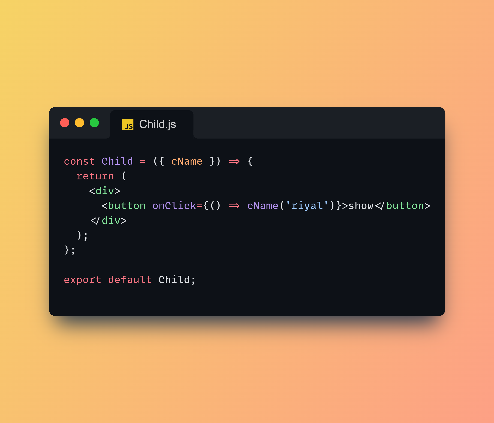

# React Child to Parent Data Communication

This is a basic example demonstrating how to pass data from a child component to a parent component in React using props and callback functions.

## Topics Covered

- Passing callback from parent to child
- Triggering parent function from child
- Lifting state up

## Run Locally

Clone the project and run `npm start`

## Screenshot

# React Child to Parent Data Communication

This is a basic example demonstrating how to pass data from a child component to a parent component in React using props and callback functions.

## Topics Covered

- Passing callback from parent to child
- Triggering parent function from child
- Lifting state up

## Run Locally

Clone the project and run `npm start`

## Screenshot

